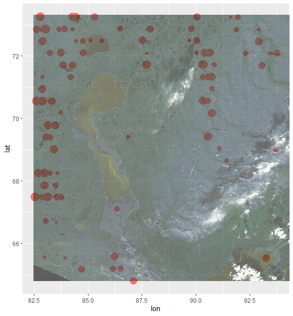

```{r setup, include=FALSE}
knitr::opts_chunk$set(echo = TRUE)
```

## Intro

This is a simple package to demonstrate my new knowlage of R packages creation. 
It based on the previous projects from the Advanced R Programming class.

## Functionality

With this package you can process raw .rds and .nc data for a different reasons.
All the documentation for the functions is included.

# data.table 

```{r echo = TRUE, eval = FALSE}
#Load the package
library(arp.assignment)
#Temerature DDF
#Assign your filenames to some var
dir <- dir()
#Run the function to read this data and make small corrections(.rds)
dt <- readData(dir('README_files'))
#Process your dataset to look properly with ddf_temp/precip
ddf <- ddf_temp(dt)
#Calculate historical ddf and delta
final_dt <- ddf_calc(final_temp)
```
# spatial data
```{r echo = TRUE, eval = FALSE}
#Load the package
library(arp.assignment)
#Read your spatial data(precipitaton, longitude and latitude)
aux <- readData_sp(dir)
#Create a dataset for the dates and forcing
dates_forcing <- read_Dates_forcing(dir)
#Summarize everything and merge it together
spatial_summary(dir, aux, dates_forcing)
```


## Visualization 

You can process spatial or numeric data and the plot it for exploration.

Here is an example of plotting the result made from using spatial data functions.(Taken from other project)

```{r echo=FALSE, fig.cap='(Sulfur dioxide pollution in Norilsk)'}

```


